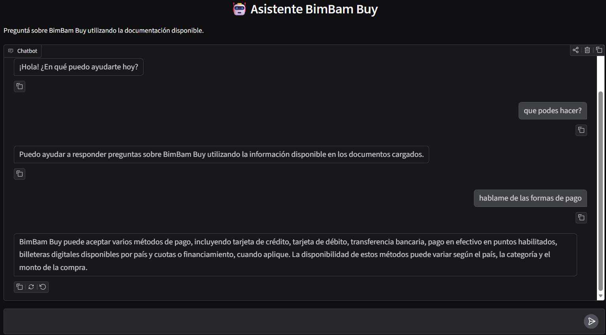

# 🤖 Asistente RAG BimBam Buy

Asistente inteligente basado en **Retrieval Augmented Generation (RAG)** que responde preguntas exclusivamente utilizando la información contenida en los documentos PDF de BimBam Buy. Permite realizar consultas en lenguaje natural sobre la documentación disponible, evitando respuestas inventadas mediante un prompt con restricciones estrictas.

---

## 🎯 Objetivo del proyecto

Brindar una herramienta conversacional capaz de responder consultas de soporte y documentación de BimBam Buy de forma precisa, citando únicamente información presente en los documentos fuente, y evitando alucinaciones típicas de los modelos de lenguaje.

---

## ✨ Características principales

- Respuestas basadas exclusivamente en documentación real (sin inventar información).
- Recuperación semántica de fragmentos relevantes mediante embeddings.
- Base vectorial persistente para evitar reprocesar los documentos en cada ejecución.
- Interfaz web conversacional simple e intuitiva mediante Gradio.
- Arquitectura modular, fácil de mantener y escalar.
- Manejo seguro de credenciales mediante variables de entorno.

---

## 🛠️ Tecnologías utilizadas

- **Python**
- **LangChain**
- **LangChain OpenAI**
- **LangChain Chroma**
- **ChromaDB** como base vectorial
- **OpenAI API**
- Embeddings con modelo `text-embedding-3-small`
- Modelo conversacional `gpt-4o-mini`
- **Gradio** para la interfaz web
- **PyPDF** para lectura de documentos PDF
- **python-dotenv** para manejo de variables de entorno

---

## 📁 Estructura del proyecto

```
PythonProject/
│
├── data/
│   └── PDFs utilizados como fuente de conocimiento del RAG
│
├── vectordb/
│   └── Base vectorial persistente generada con ChromaDB
│
├── src/
│   ├── config.py
│   │   └── Centraliza rutas, modelos y configuración general
│   │
│   ├── embeddings.py
│   │   └── Configuración del modelo de embeddings de OpenAI
│   │
│   ├── vectorstorage.py
│   │   └── Inicialización del almacenamiento vectorial con ChromaDB
│   │
│   ├── ingesta.py
│   │   └── Lee PDFs, divide documentos en fragmentos y genera embeddings
│   │
│   ├── consulta.py
│   │   └── Implementa la cadena RAG: recuperación de documentos + generación de respuesta
│   │
│   ├── llm.py
│   │   └── Configuración del modelo de lenguaje utilizado
│   │
│   ├── prompt.py
│   │   └── Define las reglas del asistente y restricciones de respuesta
│   │
│   └── interface.py
│       └── Interfaz conversacional creada con Gradio
│
└── requirements.txt
```

---

## 🏗️ Arquitectura implementada

### 1. Ingesta de documentos

- Los PDFs ubicados en la carpeta `data/` son cargados con **PyPDF**.
- Los documentos son divididos en fragmentos (*chunks*) utilizando `RecursiveCharacterTextSplitter`.
- Cada fragmento se transforma en un vector mediante `OpenAIEmbeddings` (`text-embedding-3-small`).
- Los vectores generados se almacenan de forma persistente en **ChromaDB**, dentro de `vectordb/`.

### 2. Recuperación

- Cuando un usuario realiza una pregunta, el sistema transforma la consulta en un embedding.
- Se realiza una búsqueda de similitud en ChromaDB para encontrar los fragmentos más relacionados.
- Se recupera el contenido original de los documentos correspondientes a esos fragmentos.

### 3. Generación

- Los fragmentos recuperados se envían junto con la pregunta del usuario al modelo `gpt-4o-mini`.
- El modelo genera una respuesta utilizando **únicamente** el contexto recuperado.
- El prompt del sistema (`prompt.py`) impide alucinaciones y obliga al asistente a responder:
  
  > "No tengo esa información en mis documentos."
  
  cuando la respuesta no puede sustentarse en la documentación disponible.

### 4. Interfaz

- **Gradio** proporciona una interfaz web tipo chatbot.
- El usuario escribe su pregunta y recibe una respuesta generada por el pipeline RAG en tiempo real.

```
Usuario → Interfaz (Gradio) → Consulta (consulta.py)
        → Embedding de la pregunta → Búsqueda en ChromaDB
        → Fragmentos relevantes → LLM (gpt-4o-mini)
        → Respuesta generada → Usuario
```

---

## 💬 Ejemplos de preguntas que puede responder

**Pregunta:**
"¿Qué medios de pago acepta BimBam Buy?"

**Respuesta:**
"BimBam Buy puede aceptar, según país y configuración operativa, tarjeta de crédito, tarjeta de débito, transferencia bancaria, pago en efectivo en puntos habilitados y billeteras digitales disponibles por país."

---

**Pregunta:**
"¿Qué hago si mi pago fue rechazado?"

**Respuesta:**
"Primero verifique fondos disponibles, fecha de vencimiento de la tarjeta, datos ingresados y autorización del banco o emisor."

---

**Pregunta:**
"¿Cómo puedo consultar información sobre devoluciones?"

**Respuesta:**
"El asistente busca la información relacionada dentro de los documentos cargados y responde según la documentación disponible."

---

## 🚀 Instalación y ejecución

### 1. Clonar el repositorio

```bash
git clone URL_DEL_REPOSITORIO
```

### 2. Crear entorno virtual

```bash
python -m venv .venv
```

### 3. Activar el entorno virtual

**Windows:**
```bash
.venv\Scripts\activate
```

**Linux / macOS:**
```bash
source .venv/bin/activate
```

### 4. Instalar dependencias

```bash
pip install -r requirements.txt
```

### 5. Configurar variables de entorno

Crear un archivo `.env` en la raíz del proyecto con el siguiente contenido:

```
OPENAI_API_KEY=tu_api_key
```

> ⚠️ **Importante:** el archivo `.env` y la API key nunca deben subirse al repositorio. Asegurate de incluir `.env` en el `.gitignore`.

### 6. Ejecutar la indexación inicial

```bash
python src/ingesta.py
```

Este paso lee los PDFs de la carpeta `data/`, los divide en fragmentos, genera los embeddings y construye la base vectorial persistente en `vectordb/`.

### 7. Ejecutar la aplicación

```bash
python src/interface.py
```

### 8. Abrir en el navegador

```
http://127.0.0.1:7861
```

---

## ☁️ Deploy en OCI

La aplicación fue desplegada en **Oracle Cloud Infrastructure (OCI)** para demostrar su funcionamiento fuera del entorno local.


**URL pública:**
(http://137.131.149.111:7860/)
La captura de pantalla y/o el enlace anterior evidencian que la aplicación se encuentra operativa en un entorno de nube, accesible más allá de la máquina de desarrollo.

---

## ✅ Buenas prácticas aplicadas

- Separación clara de responsabilidades entre módulos (`config`, `embeddings`, `vectorstorage`, `ingesta`, `consulta`, `llm`, `prompt`, `interface`).
- Uso de variables de entorno para el manejo seguro de credenciales sensibles.
- Base vectorial persistente para evitar reprocesamiento innecesario de documentos.
- Prompt restringido para minimizar alucinaciones del modelo.
- Código modular, legible y fácil de extender con nuevas fuentes de datos.

---

## 🔒 Seguridad de variables de entorno

Las credenciales del proyecto (como `OPENAI_API_KEY`) se gestionan exclusivamente mediante el archivo `.env`, cargado con `python-dotenv`. Este archivo **no forma parte del control de versiones** y debe configurarse manualmente en cada entorno de ejecución.

---

## 🧩 Separación de responsabilidades entre módulos

| Módulo | Responsabilidad |
|---|---|
| `config.py` | Centraliza rutas, modelos y configuración general |
| `embeddings.py` | Configura el modelo de embeddings de OpenAI |
| `vectorstorage.py` | Inicializa el almacenamiento vectorial con ChromaDB |
| `ingesta.py` | Lee PDFs, divide documentos y genera embeddings |
| `consulta.py` | Implementa la cadena RAG (recuperación + generación) |
| `llm.py` | Configura el modelo de lenguaje utilizado |
| `prompt.py` | Define las reglas y restricciones del asistente |
| `interface.py` | Implementa la interfaz conversacional con Gradio |

---

## 📌 Conclusión

**Asistente RAG BimBam Buy** demuestra la implementación completa de un pipeline de Retrieval Augmented Generation, desde la ingesta y vectorización de documentos hasta la generación de respuestas contextualizadas y su despliegue en la nube. Su arquitectura modular y las prácticas de seguridad aplicadas lo convierten en un proyecto representativo de un flujo de trabajo backend/IA real y escalable.
